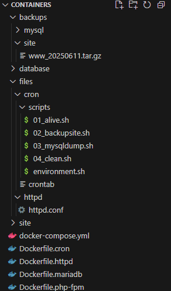

# Лабораторная работа: Обслуживание сервера

Выполнил работу студент Максименко Станислав, группа I2302
---

## Цель работы  
Обучение обслуживанию Web-серверов, работающих в контейнерах, с использованием Docker и cron для автоматизации резервного копирования и логирования.

## Задача
В рамках работы нужно: настроить Docker-контейнеры httpd, php-fpm и mariadb, добавить контейнер cron с задачами бэкапа базы и сайта и логированием, собрать всё через docker-compose, запустить WordPress, проверить резервные копии и логи, и оформить короткий отчёт.

---

## 1. Подготовка окружения

1. Установлен и запущен Docker Desktop.  
2. Создана директория проекта `additional` со структурами:  
   ```
   additional/
   ├── database/       # хранилище данных MariaDB
   ├── files/          # конфигурационные файлы и скрипты
   │   ├── httpd/
   │   └── cron/
   └── site/           # исходный код Wordpress
       └── wordpress/
   ```
   
3. Загружен и распакован Wordpress в `site/wordpress`.




---

## 2. Контейнер Apache HTTP Server

1. **Сборка образа**  
   - Создан `Dockerfile.httpd`:
     ```dockerfile
     FROM httpd:2.4
     RUN apt update && apt upgrade -y
     COPY ./files/httpd/httpd.conf /usr/local/apache2/conf/httpd.conf
     ```
     
2. **Правка конфигурации** (`files/httpd/httpd.conf`):  
   - Раскомментированы модули:
     ```apache
     LoadModule proxy_module modules/mod_proxy.so
     LoadModule proxy_http_module modules/mod_proxy_http.so
     LoadModule proxy_fcgi_module modules/mod_proxy_fcgi.so
     ```
     
   - Добавлено под `ServerName`:
     ```apache
     # определение доменного имени сайта
     ServerName wordpress.localhost:80
     # перенаправление php-запросов контейнеру php-fpm
     ProxyPassMatch ^/(.*\.php(/.*)?)$ fcgi://php-fpm:9000/var/www/html/$1
     # индексный файл
     DirectoryIndex /index.php index.php
     ```
   - Изменён `DocumentRoot` и соответствующий `<Directory>`:
     ```diff
     - DocumentRoot "C:/Apache24/htdocs"
     + DocumentRoot "/var/www/html"
     ...
     - <Directory "C:/Apache24/htdocs">
     + <Directory "/var/www/html">
     ```

Журнал общего назначения (access log) отправляется в файл дескриптора /proc/self/fd/1, то есть в STDOUT контейнера.

Журнал ошибок (error log) отправляется в файл дескриптора /proc/self/fd/2, то есть в STDERR контейнера.


## 3. Контейнер PHP-FPM

1. **Сборка образа**  
   Файл `Dockerfile.php-fpm`:
   ```dockerfile
   FROM php:7.4-fpm
   RUN apt-get update && apt-get upgrade -y && apt-get install -y \
       libfreetype6-dev libjpeg62-turbo-dev libpng-dev
   RUN docker-php-ext-configure gd --with-freetype --with-jpeg \
       && docker-php-ext-configure pdo_mysql \
       && docker-php-ext-install -j$(nproc) gd mysqli
   ```
2. Монтирование кода Wordpress в `/var/www/html`.

---

## 4. Контейнер MariaDB

1. **Сборка образа**  
   Файл `Dockerfile.mariadb`:
   ```dockerfile
   FROM mariadb:10.8
   RUN apt-get update && apt-get upgrade -y
   ```
2. Настройка через `docker-compose.yml`:
   ```yaml
   services:
     mariadb:
       build:
         context: ./
         dockerfile: Dockerfile.mariadb
       environment:
         MARIADB_DATABASE: sample
         MARIADB_USER: sampleuser
         MARIADB_PASSWORD: samplepassword
         MARIADB_ROOT_PASSWORD: rootpassword
       volumes:
         - "./database/:/var/lib/mysql"
       networks:
         - internal
   ```

---

## 5. Docker Compose

Файл `docker-compose.yml` (без поля `version:`):
```yaml
services:
  httpd:
    build:
      context: ./
      dockerfile: Dockerfile.httpd
    ports:
      - "80:80"
    volumes:
      - "./site/wordpress/:/var/www/html/"
    networks:
      - internal

  php-fpm:
    build:
      context: ./
      dockerfile: Dockerfile.php-fpm
    volumes:
      - "./site/wordpress/:/var/www/html/"
    networks:
      - internal

  mariadb:
    build:
      context: ./
      dockerfile: Dockerfile.mariadb
    environment:
      MARIADB_DATABASE: sample
      MARIADB_USER: sampleuser
      MARIADB_PASSWORD: samplepassword
      MARIADB_ROOT_PASSWORD: rootpassword
    volumes:
      - "./database/:/var/lib/mysql"
    networks:
      - internal

  cron:
    build:
      context: ./
      dockerfile: Dockerfile.cron
    environment:
      USERNAME: Maximenco Stanislav 
      MARIADB_DATABASE: sample
      MARIADB_USER: sampleuser
      MARIADB_PASSWORD: samplepassword
    volumes:
      - "./backups/:/var/backups/"
      - "./site/wordpress/:/var/www/html/"
    networks:
      - internal

networks:
  internal: {}
```

---

## 6. Сервис cron

### 6.1. Скрипты  
В `files/cron/scripts/` лежат:

- `01_alive.sh` — каждая минута пишет в лог:  
  ```sh
  #!/bin/sh
  echo "alive ${USERNAME}" > /proc/1/fd/1
  ```
- `02_backupsite.sh` — еженедельно понедельником архивирует сайт:  
  ```sh
  #!/bin/sh
  echo "[backup] create site backup" > /proc/1/fd/1 2>/proc/1/fd/2
  tar czfv /var/backups/site/www_$(date +%Y%m%d).tar.gz /var/www/html
  echo "[backup] site backup done" > /proc/1/fd/1 2>/proc/1/fd/2
  ```
- `03_mysqldump.sh` — ежедневно в 1:00 дампит БД:  
  ```sh
  #!/bin/sh
  echo "[backup] create mysql dump of ${MARIADB_DATABASE} database" > /proc/1/fd/1
  mysqldump -u ${MARIADB_USER} --password=${MARIADB_PASSWORD} -h mariadb ${MARIADB_DATABASE} \
    | gzip -c > /var/backups/mysql/${MARIADB_DATABASE}_$(date +%F_%T).sql.gz 2>/proc/1/fd/1
  echo "[backup] sql dump created" > /proc/1/fd/1
  ```
- `04_clean.sh` — ежедневно в 2:00 удаляет бэкапы старше 30 дней:  
  ```sh
  #!/bin/sh
  echo "[backup] remove old backups" > /proc/1/fd/1 2>/proc/1/fd/2
  find /var/backups/mysql -type f -mtime +30 -delete > /proc/1/fd/1 2>/proc/1/fd/2
  find /var/backups/site  -type f -mtime +30 -delete > /proc/1/fd/1 2>/proc/1/fd/2
  echo "[backup] done" > /proc/1/fd/1 2>/proc/1/fd/2
  ```

### 6.2. Crontab  
Файл `files/cron/crontab`:
```cron
# Минута Час  Дата_месяц Месяц День_недели Команда
*     *   *   *   *   /scripts/01_alive.sh > /dev/null

0     1   *   *   *   /scripts/03_mysqldump.sh > /dev/null
0     1   *   *   1   /scripts/02_backupsite.sh > /dev/null
0     2   *   *   *   /scripts/04_clean.sh > /dev/null

# Пустая строка в конце обязательна
```


---

## 7. Тестирование и результаты

1. Сборка образов:
   ```bash
   docker-compose build
   ```
   _Время сборки: ____ секунд._

2. Запуск кластера:
   ```bash
   docker-compose up -d
   ```
3. Проверка сайта в браузере:  
   **http://wordpress.localhost**  
   

4. Логи контейнеров:
   ```bash
   docker logs additional-cron-1
   ```

5. Проверка директорий бэкапов через 2–3 минуты:
   - `./backups/mysql/`  
   - `./backups/site/`  
  
  

  Сам проект собирался 159.1s 

---

## 8. Ответы на вопросы

1. **Зачем необходимо создавать пользователя системы для каждого сайта?**  
   Чтобы изолировать права доступа процессам разных сайтов, ограничить последствия потенциального взлома и упростить администрирование прав на уровне ОС.

2. **В каких случаях Web-сервер должен иметь полный доступ к папкам сайта?**  
   Когда требуется запись файлов (например, кэш, логи, загрузка медиа), установка плагинов/тем, динамическое генерирование контента.

3. **Что означает команда `chmod -R 0755 /home/www/anydir`?**  
   Рекурсивно задаёт права `rwxr-xr-x` (владелец: читать/писать/выполнять; группа и остальные: читать/выполнять) для всех файлов и папок внутри `/home/www/anydir`.

4. **В скриптах shell каждая команда оканчивается `> /proc/1/fd/1`. Что это означает?**  
   Перенаправление STDOUT внутрь основного процесса контейнера (PID 1), чтобы логи выводились на стандартный поток вывода Docker и были доступны через `docker logs`.

---
